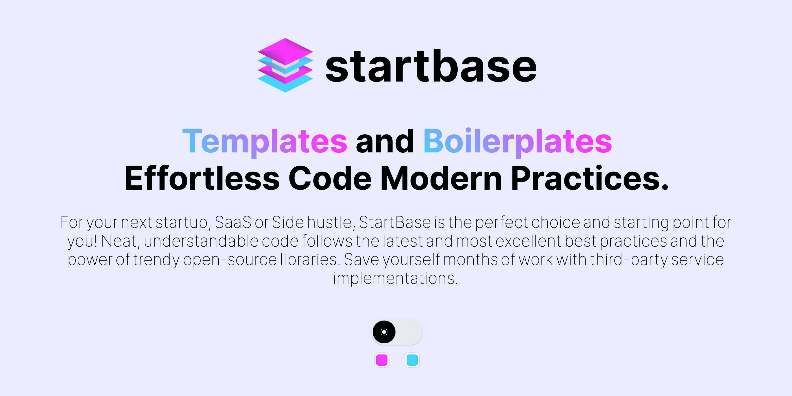

# @start-base/react-modal


## Introduction

Accessible modal dialog component and global modals provider for React.JS. This package is a enhanced version of [`react-modal`](https://github.com/reactjs/react-modal/).

- React portal
- Global modals provider
- Hooks

## Installation

To install, you can use [npm](https://npmjs.org/) or [yarn](https://yarnpkg.com):

```bash title="Terminal"
    $ npm install --save @start-base/react-modal
```

or

```bash title="Terminal"
    $ yarn add @start-base/react-modal
```

## Usage

The primary documentation for Modal component is the
[react-modal](https://reactjs.github.io/react-modal), which describes the API
and gives examples of its usage.

Nextjs example can show all features how to use.

To style the modal, you can utilize the `className` and `overlayClassName` props. When it comes to Next.js client-side rendering, you can re-export components with a comment indicating the use of the `use client` approach.

```jsx title="Modal.js"
'use client';
import {
  Modal as ReactModal,
  GlobalModals,
  ModalProvider,
  useModal,
} from '@start-base/react-modal';

import styles from './Modal.module.css';

const Modal = ({ ...props }) => (
  <ReactModal
    appElement="html"
    {...props}
    className={styles.modal}
    overlayClassName={styles.overlay}
  />
);

export { Modal, GlobalModals, ModalProvider, useModal };
```

```jsx title="page.js"
import styles from './page.module.css';
import CustomModal from '@/components/CustomModal';

export default function Home() {
  return (
    <main className={styles.main}>
      <div className={styles.center}>
        <CustomModal />
      </div>
    </main>
  );
}
```

```jsx title="layout.js"
import { Inter } from 'next/font/google';
import { ModalProvider } from '@start-base/react-modal';
import Modals from '@/components/Modals';

const inter = Inter({ subsets: ['latin'] });

export const metadata = {
  title: 'Create Next App',
  description: 'Generated by create next app',
};

export default function RootLayout({ children }) {
  return (
    <html lang="en">
      <body className={inter.className}>
        <ModalProvider>
          {children}
          <Modals />
        </ModalProvider>
      </body>
    </html>
  );
}
```

```jsx title="components/CustomModal.js"
'use client';
import { Modal, useModal } from '@start-base/react-modal';
import { useState } from 'react';

export default function CustomModal() {
  const [isModalOpen, setIsModalOpen] = useState(false);
  const { openModal } = useModal();

  return (
    <>
      <button onClick={() => setIsModalOpen(true)}>open</button>
      <Modal
        shouldCloseOnOverlayClick={true}
        onRequestClose={() => setIsModalOpen(false)}
        isOpen={isModalOpen}
        contentLabel="Minimal Modal Example"
      >
        local modal
        <button onClick={() => setIsModalOpen(false)}>close</button>
        <button onClick={() => openModal('modal-1')}>
          open global modal-1
        </button>
      </Modal>
    </>
  );
}
```

```jsx title="components/Modals.js"
'use client';
import { Modal, useModal, GlobalModals } from '@start-base/react-modal';

export default function Modals() {
  const { closeModal, openModal } = useModal();

  return (
    <GlobalModals>
      <Modal
        name="modal-1"
        style={{
          content: {
            width: '500px',
            height: '500px',
          },
        }}
      >
        global modal-1
        <button onClick={() => closeModal('modal-1')}>close modal-1</button>
        <button onClick={() => openModal('modal-2')}>open modal-2</button>
      </Modal>
      <Modal
        name="modal-2"
        style={{
          content: {
            width: '400px',
            height: '400px',
          },
        }}
      >
        global modal-2
        <button onClick={() => closeModal('modal-2')}>close modal-2</button>
        <button onClick={() => openModal('modal-3')}>open modal-3</button>
      </Modal>
      <Modal
        name="modal-3"
        style={{
          content: {
            width: '300px',
            height: '300px',
          },
        }}
      >
        global modal-3
        <button onClick={() => closeModal('modal-3')}>close modal-3</button>
        <button onClick={() => openModal('modal-4')}>open modal-4</button>
      </Modal>
      <Modal
        name="modal-4"
        style={{
          content: {
            width: '200px',
            height: '200px',
          },
        }}
      >
        global modal-4
        <button onClick={() => closeModal('modal-4')}>close modal-4</button>
      </Modal>
    </GlobalModals>
  );
}
```

## Components

### Modal

### GlobalModals

## Provider

### ModalProvider

## Hook

### useModal

## Styling and Animation

Dont forget to add closeTimeoutMS props to Modal component.

```jsx title="Modal.js"
'use client';

import {
  Modal as ReactModal,
  GlobalModals,
  ModalProvider,
  useModal,
} from '@start-base/react-modal';

import styles from './Modal.module.css';

const Modal = ({ ...props }) => (
  <ReactModal
    closeTimeoutMS={400}
    appElement="html"
    {...props}
    className={styles.modal}
    overlayClassName={styles.overlay}
  />
);

export { Modal, GlobalModals, ModalProvider, useModal };
```

```css title="Modal.module.css"
.modal {
  position: fixed;
  top: 50%;
  left: 50%;
  transform: translate(-50%, -50%) scale(0.8);
  padding: 2rem;
  overflow: auto;
  outline: none;
  border-radius: 10px;
  background-color: var(--black);
  box-shadow:
    0 1px 5px rgba(0, 0, 0, 0.2),
    0 1px 10px rgba(0, 0, 0, 0.1);
  cursor: pointer;
  color: var(--white);
  opacity: 0;
  transition:
    opacity 0.3s ease,
    transform 0.3s cubic-bezier(0.68, -0.55, 0.27, 1.55);

  @media (max-width: 768px) {
    max-width: 90%;
  }
}

.modal[class~='ReactModal__Content--after-open'] {
  opacity: 1;
  transform: translate(-50%, -50%) scale(1);
}

.modal[class~='ReactModal__Content--before-close'] {
  opacity: 0;
  transform: translate(-50%, -50%) scale(0.8);
}

.overlay {
  position: fixed;
  inset: 0;
  background-color: rgba(0, 0, 0, 0);
  transition: background-color 0.3s ease;
}

.overlay[class~='ReactModal__Overlay--after-open'] {
  background-color: rgba(0, 0, 0, 0.5);
}

.overlay[class~='ReactModal__Overlay--before-close'] {
  background-color: rgba(0, 0, 0, 0);
}
```

## Examples

- [Nextjs Global Modals Example](/examples/nextjs)

## Demos

There are several demos hosted on [Vercel](https://react-modal-tau.vercel.app/) which
demonstrate various features of @start-base/react-modal:

- [Nextjs Demo](https://react-modal-tau.vercel.app/)


<br />

<div align="center">
<a href="https://startbase.dev/oss/react-form-elements">Website</a> 
<span> · </span>
<a href="https://www.npmjs.com/search?q=%40start-base">Npm</a> 
<span> · </span>
<a href="https://twitter.com/start_base_dev">Twitter</a>
</div>

<br />
<div align="center">
  <sub>Developed by <a href="https://startbase.dev">Startbase</a> 🧑‍💻</sub>
</div>

<br />
