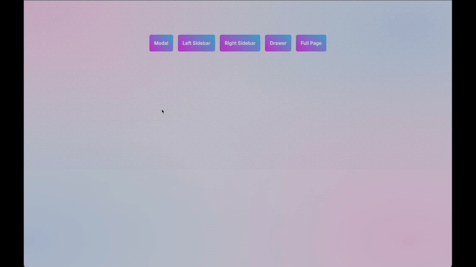

<p align="center">
  <a href="https://startbase.dev" target="_blank">
    
  </a>
</p>

<h1 align="center">@start-base/react-modal</h1>

<p align="center">
Accessible modal dialog component and global modals provider for React. This package is a enhanced version of <a href="https://github.com/reactjs/react-modal/">react-modal</a>.

</p>
<p align="center">
<a href="https://www.npmjs.com/package/@start-base/react-modal">@start-base/react-modal</a> is part of the <a href="https://www.npmjs.com/package/@start-base/start-ui">@start-base/start-ui</a> UI library but can also be used individually.
</p>

<p align="center">
    <a href="https://github.com/startbase-dev/react-modal/blob/main/LICENSE"></a>
    <a href="https://www.npmjs.com/package/@start-base/react-modal"></a>
    <a href="https://www.npmjs.com/package/@start-base/react-modal"></a>
    <a href="https://www.npmjs.com/package/@start-base/react-modal"></a>
</p>

---

<p align="center">

</p>

## Documentation

For full documentation, visit [start-ui.startbase.dev](https://start-ui.startbase.dev/docs/overlayComponents/modal).

## Installation

```bash title="Terminal"
npm install --save @start-base/react-modal
```

## Features

- React portal
- Global modals provider
- Hooks

## Demos

There is a [Nextjs Global Modals Example](/examples/nextjs) hosted on [Nextjs Demo](https://react-modal-tau.vercel.app/) which
demonstrate various features of @start-base/react-modal.

## Contributing

Contributions are welcomed. Feel free to submit pull requests and improvements to the project!

## Contributors

<table>
  <tr>
    <td align="center">
      <br />
      <sub><a href="https://github.com/yunusozcan">yunusozcan</a></sub>
    </td>
    <td align="center">
      <br />
      <sub><a href="https://github.com/emreonursoy">emreonursoy</a></sub>
    </td>
  </tr>
</table>
